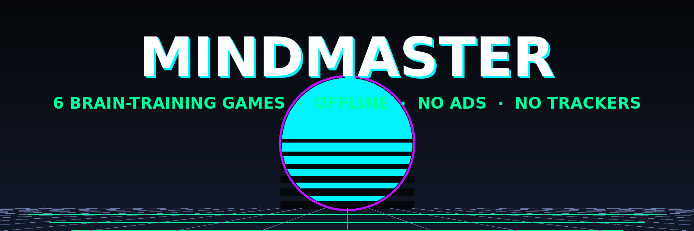

# MindMaster — Brain Training Games

> 6 brain-training games in one app. Built with pure HTML, CSS & JavaScript. No frameworks, no downloads. Just play.



## 🎮 Games

| Game | Description | Difficulty |
|------|-------------|------------|
| **Math Sprint** | 60 seconds of speed math. +, -, ×, ÷ | Easy / Medium / Hard |
| **Logic Puzzles** | Sudoku-lite puzzles, 4×4 to 9×9 grids | Easy (4×4) / Medium (6×6) / Hard (9×9) |
| **Color Match** | Stroop test. Tap the COLOR, not the word! | 4 / 6 / 8 colors |
| **Focus Grid** | Tap 1-25 in order. How fast can you go? | 4×4 / 5×5 / 6×6 |
| **Memory Matrix** | Pair matching on 4×4 / 6×6 / 8×8 boards | Easy / Medium / Hard |
| **Pattern Recall** | Simon Says style game on a 3D pad | Easy / Medium / Hard |

## ✨ Features

- **Pure Web** — HTML, CSS & JavaScript only. No frameworks.
- **Offline Ready** — No external CDN dependencies. Works without internet.
- **2040 Aesthetic** — Glassmorphism, neon accents, particle backgrounds.
- **Mouse Tracking** — Interactive 3D tilt effects on cards.
- **Sound Effects** — Procedural audio synthesis (Web Audio API).
- **Haptic Feedback** — Vibration support on mobile devices.
- **Progress Tracking** — Local storage for scores & achievements.
- **Responsive** — Works on mobile, tablet & desktop.

## 🚀 Play Now

**Live URL:** https://fsix7115-arch.github.io/MindMaster/

**Install as app (PWA):** open the live URL in Chrome/Edge → "Add to Home screen" → launches fullscreen, works offline via service worker.

**Android APK:** see [Releases](https://github.com/fsix7115-arch/MindMaster/releases) — `mindmaster-vX.Y.Z.apk` installs the offline web app as a standalone Android app (no ads, no trackers, no permissions).

Or run locally:
```bash
cd mindmaster
python3 -m http.server 8080
# Open http://localhost:8080
```

## 🏆 Leaderboard

Your landing page shows a live leaderboard — per-game best scores, total sessions, and a top-10 across all games. Data lives in your browser (IndexedDB); nothing leaves the device.

## ✨ Features

- **Pure Web** — HTML, CSS & JavaScript only. No frameworks.
- **Offline Ready** — No external CDN dependencies. Works without internet (service worker precaches all 6 games).
- **Installable** — Web App Manifest + maskable icons: Add to Home Screen / APK.

## 📁 Project Structure

```
mindmaster/
├── index.html              # Landing page + live leaderboard
├── math-sprint.html        # Speed math game
├── logic-puzzles.html      # Sudoku-lite puzzles
├── color-match.html        # Stroop color test
├── focus-grid.html         # Number tap challenge
├── memory-matrix.html      # Pair-matching memory game
├── pattern-recall.html     # Simon-style recall game
├── manifest.json           # PWA manifest (installable)
├── sw.js                   # Service worker (offline cache)
├── website/                # Static mirror deployed to GitHub Pages
├── assets/
│   ├── css/
│   │   └── styles.css      # 2040 futuristic theme
│   ├── js/
│   │   ├── core/           # Engine, storage, audio, haptics, leaderboard
│   │   ├── games/          # Game modules
│   │   └── shared/         # Reusable UI components
│   ├── icons/              # PWA icons (72–512, incl. maskable)
│   └── models/             # 3D assets
└── docs/
    └── screenshots/        # Game screenshots
```

## 📦 Building the Android APK

The APK wraps the offline web app (all 6 games, zero network) using Android's
trusted WebView — no ads, no SDKs, no permissions beyond storage-free operation.

```bash
# Requires Android SDK cmdline-tools + build-tools 34
bash tools/build-apk.sh          # outputs MindMaster-vX.Y.Z.apk
```

The script is idempotent: it creates the Android project under `android/`,
injects the web assets into `android/app/src/main/assets/web/`, signs with a
release keystore, and produces an aligned, signed APK ready for upload to a
GitHub Release.

## 🎨 Tech Stack

- **HTML5** — Semantic markup
- **CSS3** — Glassmorphism, animations, responsive design
- **JavaScript (ES6+)** — No frameworks
- **Web Audio API** — Procedural sound synthesis
- **IndexedDB** — Local game data persistence
- **Three.js** — 3D elements (optional)

## 🛠️ Development

```bash
# Clone the repo
git clone https://github.com/fsix7115-arch/MindMaster.git
cd MindMaster

# Make changes
# Edit HTML, CSS, or JS files

# Test locally
python3 -m http.server 8080

# Commit & push
git add .
git commit -m "Your message"
git push origin main
```

## 📱 Browser Support

- Chrome 80+
- Firefox 75+
- Safari 14+
- Edge 80+
- Mobile browsers

## 📄 License

MIT License — Free for personal & commercial use.

## 👨💻 Author

Built with ❤️ by **Aether** (AI Assistant) for the MindMaster project.

---

**MindMaster** — Train your brain, one game at a time.